# chrissx.de config files

> [!NOTE]
> We have big changes coming, which are [listed on our website](https://chrissx.de/#notices).

These are most of the config files and scripts used on chrissx Media operated infrastructure.

## Infrastructure

```mermaid
graph LR

subgraph rosenhof["Rosenhof (cM Infra)"]
  rotmain

  subgraph tobias
    subgraph dockerop[docker]
      simon
      tor-proxy
      nginxop[nginx]
      ludwigop[ludwig]
      ali
      murmur
      minecraft
      home-assistant
      inventree
      bucket
      watchtowertobias[watchtower]
    end
    backup.timer
    nginxop -- 1339 --> inventree
    nginxop -- 8123 --> home-assistant
    nginxop -- 8022 --> bucket
  end
  backup.timer -- 873 --> rotmain
end

subgraph nuremberg["Nuremberg (Hetzner Infra)"]
  subgraph sophia
    nginxsophia[nginx]
    subgraph dockersophia[docker]
      inspiriererin
      jana -- 2333 --> lavalink
      ludwigsophia[ludwig]
      redirector
      deployment
      kinkcheck.top
      bottom.kinkcheck.top
      jasmin
      erwin
      watchtowersophia[watchtower]
    end
    nginxsophia -- 4321 --> kinkcheck.top
    nginxsophia -- 4322 --> bottom.kinkcheck.top
    nginxsophia -- 8099 --> jasmin
    nginxsophia -- 8080 --> erwin
  end
end

cloudflare(cloudflare.com)
simon --> cloudflare
simon --> nginxsophia

internet(Users)
internet -- "9053, 9052, 9050" --> tor-proxy
internet -- "443, 80" --> nginxop[nginx]
internet -- 70 --> ludwigop[ludwig]
internet -- "993, 143, 587, 25" --> ali
internet -- 64738 --> murmur
internet -- 25565 --> minecraft
internet -- 443 --> nginxsophia
internet -- 70 --> ludwigsophia[ludwig]
internet -- 80 --> redirector
internet -- 8080 --> erwin
discord(discord.com)
inspiriererin --> discord
jana --> discord

classDef docker fill:#0092e7,stroke:#000
class dockerop docker
class dockersophia docker
classDef location fill:#000,stroke:#808080
class rosenhof location
class nuremberg location
classDef server fill:#222,stroke:#000
class tobias server
class rotmain server
class sophia server

click tor-proxy "https://github.com/pixelcmtd/docker-containers/tree/master/tor-proxy" _blank
click ludwigop "https://github.com/chrissxMedia/chrissx.de.conf.sh/tree/master/ludwig" _blank
click simon "https://github.com/chrissxMedia/chrissx.de.conf.sh/tree/master/simon" _blank
click ali "https://github.com/chrissxMedia/chrissx.de.conf.sh/tree/master/ali" _blank
click murmur "https://github.com/mumble-voip/mumble-docker" _blank
click minecraft "https://github.com/itzg/docker-minecraft-server" _blank
click home-assistant "https://github.com/home-assistant/core" _blank
click inventree "https://docs.inventree.org/en/latest/start/docker/" _blank
click bucket "https://github.com/pixelcmtd/bucket" _blank
click watchtowertobias "https://containrrr.dev/watchtower/" _blank
click aggregamus "https://github.com/Ampless/aggregamus" _blank
click ludwigsophia "https://github.com/chrissxMedia/chrissx.de.conf.sh/tree/master/ludwig" _blank
click inspiriererin "https://github.com/pixelcmtd/Inspiriererin" _blank
click jana "https://github.com/chrissxMedia/jana" _blank
click lavalink "https://github.com/lavalink-devs/Lavalink/pkgs/container/lavalink" _blank
click redirector "https://github.com/chrissxMedia/redirector" _blank
click watchtowersophia "https://containrrr.dev/watchtower/" _blank
click kinkcheck.top "https://github.com/chrissxMedia/KinkCheck.Top" _blank
click bottom.kinkcheck.top "https://github.com/chrissxMedia/KinkCheck.Top/tree/bottom" _blank
click jasmin "https://github.com/ZERMZeitung/jasmin" _blank
click erwin "https://github.com/chrissxMedia/erwin" _blank
click deployment "https://github.com/chrissxMedia/deployment" _blank
```



### Hardware

| Hostname    | Hardware                                    | Location  | OS                   | Status                | Cost    |
| ----------- | ------------------------------------------- | --------- | -------------------- | --------------------- | ------- |
| sophia      | Hetzner CX11                                | Nuremberg | Ubuntu Server 22.04  | running               | 5.3€/mo |
| tobias      | Lenovo ThinkCentre M710s                    | Rosenhof  | Ubuntu Server 22.04  | running               | 140€    |
| rotmain     | Synology DS1821+, 8x Seagate IronWolf 8TB   | Rosenhof  | DSM 7                | running               | 3500€   |
| veldenstein | Custom (Pentium G4400 based), 4x WD Red 4TB | Rosenhof  | Ubuntu Desktop 22.04 | emergency cold backup | 1000€   |

### DNS

#### Internal

> [!NOTE]
> For some reason `tobias.chrissx.de` gets lost somewhere in the chain of DNS servers most of the time, so we use `op.chrissx.de` (named after the old `optiplex`) instead.

| Type  | Name                   | Content               |
| ----- | ---------------------- | --------------------- |
| A     | `op.chrissx.de`        | `192.168.178.68`      |
| A     | `rotmain.chrissx.de`   | `192.168.178.29`      |

#### External

| Type  | Name                           | Content                    |
| ----- | ------------------------------ | -------------------------- |
| A     | `rosenhof.chrissx.de`          | (DynDNS)                   |
| AAAA  | `rosenhof.chrissx.de`          | (DynDNS)                   |
| A     | `sophia.chrissx.de`            | `78.47.163.103`            |
| AAAA  | `sophia.chrissx.de`            | `2a01:4f8:c0c:69c8::`      |
| CAA   | `chrissx.de`                   | `0 issue letsencrypt.org`  |
| MX    | `chrissx.de`                   | `mail.chrissx.de`          |
| CNAME | `autoconfig.chrissx.de`        | `rosenhof.chrissx.de`      |
| CNAME | `bucket.chrissx.de`            | `rosenhof.chrissx.de`      |
| CNAME | `cpm.chrissx.de`               | `sophia.chrissx.de`        |
| CNAME | `fonts.chrissx.de`             | `sophia.chrissx.de`        |
| CNAME | `git.chrissx.de`               | `rosenhof.chrissx.de`      |
| CNAME | `ha.chrissx.de`                | `rosenhof.chrissx.de`      |
| CNAME | `inv.chrissx.de`               | `rosenhof.chrissx.de`      |
| CNAME | `lyrics.chrissx.de`            | `sophia.chrissx.de`        |
| CNAME | `mail.chrissx.de`              | `rosenhof.chrissx.de`      |
| CNAME | `media.chrissx.de`             | `sophia.chrissx.de`        |
| CNAME | `meme.chrissx.de`              | `sophia.chrissx.de`        |
| CNAME | `mumble.chrissx.de`            | `rosenhof.chrissx.de`      |
| CNAME | `new.chrissx.de`               | `sophia.chrissx.de`        |
| CNAME | `pixel.chrissx.de`             | `sophia.chrissx.de`        |
| CNAME | `porn.chrissx.de`              | `sophia.chrissx.de`        |
| CNAME | `qa.chrissx.de`                | `sophia.chrissx.de`        |
| CNAME | `screwed.chrissx.de`           | `sophia.chrissx.de`        |
| CNAME | `tor.chrissx.de`               | `op.chrissx.de`            |
| CNAME | `wiki.chrissx.de`              | `sophia.chrissx.de`        |
| CNAME | `chrissx.de`                   | `sophia.chrissx.de`        |
| CNAME | `chrisxeric.de`                | `sophia.chrissx.de`        |
| CNAME | `elonisnwichser.de`            | `sophia.chrissx.de`        |
| CNAME | `fuxgames.com`                 | `sophia.chrissx.de`        |
| CNAME | `gock.dev`                     | `sophia.chrissx.de`        |
| CNAME | `kinkcheck.top`                | `sophia.chrissx.de`        |
| CNAME | `lowlevelmusic.com`            | `sophia.chrissx.de`        |
| CNAME | `zerm.eu`                      | `sophia.chrissx.de`        |
| CNAME | `zerm.link`                    | `sophia.chrissx.de`        |
| CNAME | `www.chrissx.de`               | `chrissx.de`               |
| CNAME | …                              | …                          |
| CNAME | `www.zerm.link`                | `zerm.link`                |

### Software

#### sophia → ruby (nuremberg server)

A rough description of the current setup on `sophia` and planned changes (especially for its replacement, Project NEV, Server `ruby`) can be found below. A semi-automatic `cloud-config` + `docker-compose` install is under preparation. `cloud-init` will automatically install:

- /var/deployment/conf
- /etc/docker/daemon.json
- /root/.gitconfig
- watchtower

The following steps are left to the admin:

- Git key (/ghpass)
- Cloudflare key (.env)
- Lavalink, jana, insp8n (will be dealt with later)

`docker-compose` will start the following services:

- 5x certbot
- deployment
- redirector
- erwin
- jasmin
- bottom.kinkcheck.top
- kinkcheck.top
- nginx

##### Misc

```sh
docker run -d --restart=unless-stopped --pull=always --name ludwig -p70:70 chrissx/ludwig:latest
docker run -d --restart=unless-stopped --pull=always --name redirector -p80:80 chrissx/redirector:latest
docker run -d --restart=unless-stopped --pull=always --name erwin --network host chrissx/erwin:latest

docker run -d --restart=unless-stopped --pull=always --name watchtower -v/var/run/docker.sock:/var/run/docker.sock containrrr/watchtower --interval 3600
```

> ludwig will not be deployed on `ruby`.

> We will not be able to evaluate watchtower replacements in time for the NEV migration.

> For simplicity, we will be treating `redirector` and `erwin` as Web services, thereby eliminating the Misc category for NEV.

##### Web

```sh
docker run -d --restart=unless-stopped --pull=always --name deployment -v/var/deployment:/var/deployment -v/root/.gitconfig:/root/.gitconfig -v/ghpass:/ghpass -e GIT_ASKPASS=/ghpass chrissx/deployment:latest -D -H /var/deployment -d /var/deployment/conf/ruby/deployments.csv

docker run -d --restart=unless-stopped --pull=always --name jasmin -p8099:8099 -v/var/deployment/zerm:/var/www/zerm.eu ghcr.io/zermzeitung/jasmin:latest
docker run -d --restart=unless-stopped --pull=always --name kct-bottom -p4322:4321 -v$PWD/bottom.db:/data/kinkcheck.db chrissx/kinkcheck.top:bottom
docker run -d --restart=unless-stopped --pull=always --name kct-main -p4321:4321 -v$PWD/kct-data:/data chrissx/kinkcheck.top:latest
```

nginx runs through systemd. certbot is still only executed manually. All domains share a single certificate.

###### NEV changes

There has not been a final decision on whether nginx will be deployed with Docker. We're also currently exploring options for configuration management. The most likely setup looks like this:

```sh
docker network create webservices --ipv6
docker run -d --restart=unless-stopped --pull=always --name nginx -v/var/deployment/conf/nginx/conf.d:/etc/nginx/conf.d:ro -v/etc/letsencrypt:/etc/letsencrypt:ro -v/var/deployment/dist:/var/www:ro --network webservices -p443:443 nginx:stable-alpine

docker run -d --restart=unless-stopped --pull=always --name erwin --network webservices -p8080:8080 chrissx/erwin:latest
# jasmin and kct with --network webservices instead of -p
# redirector with --network webservices to avoid having to enable ipv6 for the default bridge
```

Certificates and nginx configs will be split into `cm`, `kct`, `pixel`, `zerm`, `emily`. Certbot will run with automatic Cloudflare DNS validation. Because running multiple containers for this seems like a significant burden (the memory consumption is very reasonable tho, about 10-20 MB/instance), it is still undecided whether we will use the following Docker image:

```sh
docker run -d --restart=unless-stopped --pull=always --name certbot-XXX -e CERTBOT_DOMAINS="XXX" -e CERTBOT_EMAIL="XXX+isrgletsencrypt@chrissx.de" -e CLOUDFLARE_API_TOKEN="XXX" -v/etc/letsencrypt:/etc/letsencrypt serversideup/certbot-dns-cloudflare:latest
```

The KCT Bottom instance will get its own directory.

##### Discord Bots

> The Lavalink config is currently missing from this repo.

```sh
docker network create lavalink
docker run -d --restart=unless-stopped --pull=always --name lavalink --network lavalink -v$PWD/lavalink.yml:/opt/Lavalink/application.yml ghcr.io/lavalink-devs/lavalink:4
docker run -d --restart=unless-stopped --pull=always --name jana --network lavalink -e JANA_DISCORD_TOKEN=XXX -e JANA_LAVALINK_BASE=http://lavalink:2333 -e JANA_LAVALINK_PASSWORD=XXX chrissx/jana:latest
docker run -d --restart=unless-stopped --pull=always --name insp -p8989:8989 -e INSP_DISCORD_TOKEN=XXX chrissx/inspiriererin:latest
```

###### Issues & possible changes (mostly unrelated to NEV)

The Hetzner IP ranges make it impossible to run Lavalink and `jana`'s other ("Explode API" based) YouTube services. Therefore, it has been disabled for a while. There are a few possible solutions to this (e.g. OAuth authentication, `poToken`, the official YouTube API, ...), but the easiest would be to migrate `jana` (and, to concentrate the Discord bots on a single server, also `inspiriererin`) back to Rosenhof (i.e. `tobias`). A decision on this has not been made yet.

###### Temporary NEV state / postponed migration

`ruby` will be set up without any of the three Discord-related containers. They will keep running on `sophia` for a while. During that, a Docker Compose recipe will be written. Where and when said recipe will be deployed is still undetermined. A future rework (or replacement) of `tobias` is the most likely target.

<!-- vim: set wrap! : -->
