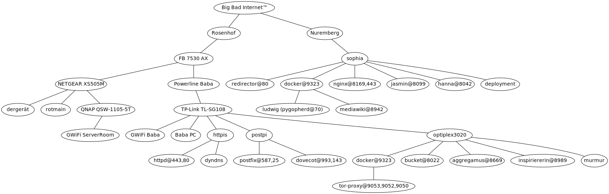

# [chrissx.de](https://chrissx.de) config files

These are most of the config files and scripts used for chrissx.de.

## Infrastructure

### Hardware

| Hostname     | Hardware                                    | Location  | OS                   | Status                        | Cost     |
| ------------ | ------------------------------------------- | --------- | -------------------- | ----------------------------- | -------- |
| sophia       | Hetzner CX11                                | Nuremberg | Ubuntu Server 22.04  | running                       | 3.56€/mo |
| rotmain      | Synology DS1821+, 8x Seagate IronWolf 8TB   | Pegnitz   | DSM 7                | running                       | 3500€    |
| httpis       | Raspberry Pi 3B+                            | Pegnitz   | Raspbian Bullseye    | running                       | 35€      |
| postpi       | Raspberry Pi 3B+                            | Pegnitz   | Raspbian Bullseye    | running                       | 35€      |
| optiplex3020 | Dell OptiPlex 3020                          | Pegnitz   | Ubuntu Server 22.04  | running                       | 80€      |
| veldenstein  | Custom (Pentium G4400 based), 4x WD Red 4TB | Pegnitz   | Ubuntu Desktop 20.04 | not running, emergency backup | 1000€    |

<!-- vim: set wrap! : -->
