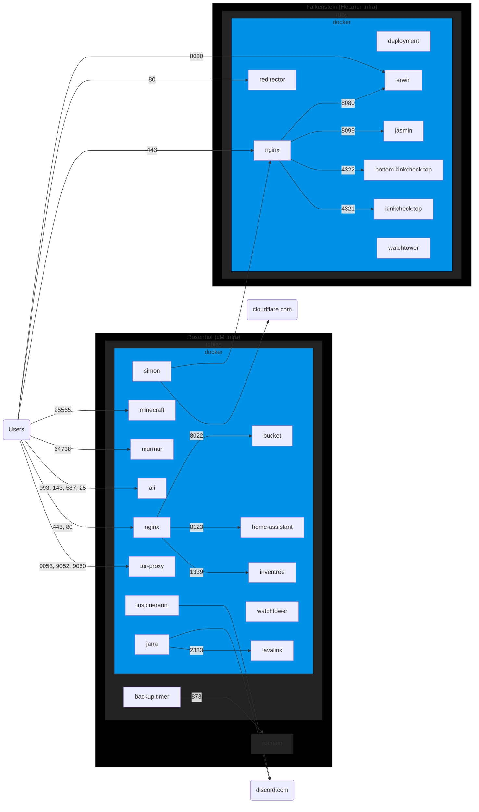

# chrissx.de config files

These are most of the config files and scripts used on chrissx Media operated infrastructure.

## Overview


```mermaid
graph LR

subgraph rosenhof["Rosenhof (cM Infra)"]
  rotmain

  subgraph tobias
    subgraph dockerop[docker]
      simon
      tor-proxy
      nginxop[nginx]
      ali
      murmur
      minecraft
      home-assistant
      inventree
      bucket
      watchtowertobias[watchtower]
      inspiriererin
      jana -- 2333 --> lavalink
    end
    backup.timer
    nginxop -- 1339 --> inventree
    nginxop -- 8123 --> home-assistant
    nginxop -- 8022 --> bucket
  end
  backup.timer -- 873 --> rotmain
end

subgraph falkenstein["Falkenstein (Hetzner Infra)"]
  subgraph ruby
    subgraph dockerruby[docker]
      nginxruby[nginx]
      redirector
      deployment
      kinkcheck.top
      bottom.kinkcheck.top
      jasmin
      erwin
      watchtowerruby[watchtower]
    end
    nginxruby -- 4321 --> kinkcheck.top
    nginxruby -- 4322 --> bottom.kinkcheck.top
    nginxruby -- 8099 --> jasmin
    nginxruby -- 8080 --> erwin
  end
end

cloudflare(cloudflare.com)
simon --> cloudflare
simon --> nginxruby

internet(Users)
internet -- "9053, 9052, 9050" --> tor-proxy
internet -- "443, 80" --> nginxop[nginx]
internet -- "993, 143, 587, 25" --> ali
internet -- 64738 --> murmur
internet -- 25565 --> minecraft
internet -- 443 --> nginxruby
internet -- 80 --> redirector
internet -- 8080 --> erwin
discord(discord.com)
inspiriererin --> discord
jana --> discord

classDef docker fill:#0092e7,stroke:#000
class dockerop docker
class dockerruby docker
classDef location fill:#000,stroke:#808080
class rosenhof location
class nuremberg location
class falkenstein location
classDef server fill:#222,stroke:#000
class tobias server
class rotmain server
class ruby server

click tor-proxy "https://github.com/pixelcmtd/docker-containers/tree/master/tor-proxy" _blank
click simon "https://github.com/chrissxMedia/chrissx.de.conf.sh/tree/master/simon" _blank
click ali "https://github.com/chrissxMedia/chrissx.de.conf.sh/tree/master/ali" _blank
click murmur "https://github.com/mumble-voip/mumble-docker" _blank
click minecraft "https://github.com/itzg/docker-minecraft-server" _blank
click home-assistant "https://github.com/home-assistant/core" _blank
click inventree "https://docs.inventree.org/en/latest/start/docker/" _blank
click bucket "https://github.com/pixelcmtd/bucket" _blank
click watchtowertobias "https://containrrr.dev/watchtower/" _blank
click aggregamus "https://github.com/Ampless/aggregamus" _blank
click inspiriererin "https://github.com/pixelcmtd/Inspiriererin" _blank
click jana "https://github.com/chrissxMedia/jana" _blank
click lavalink "https://github.com/lavalink-devs/Lavalink/pkgs/container/lavalink" _blank
click redirector "https://github.com/chrissxMedia/redirector" _blank
click watchtowerruby "https://containrrr.dev/watchtower/" _blank
click kinkcheck.top "https://github.com/chrissxMedia/KinkCheck.Top" _blank
click bottom.kinkcheck.top "https://github.com/chrissxMedia/KinkCheck.Top/tree/bottom" _blank
click jasmin "https://github.com/ZERMZeitung/jasmin" _blank
click erwin "https://github.com/chrissxMedia/erwin" _blank
click deployment "https://github.com/chrissxMedia/deployment" _blank
```

## Hardware

| Hostname    | Hardware                                    | Location    | OS                   | Status                | Cost    |
|-------------|---------------------------------------------|-------------|----------------------|-----------------------|---------|
| ruby        | Hetzner CX23                                | Falkenstein | Ubuntu Server 24.04  | running               | 4.9€/mo |
| tobias      | Lenovo ThinkCentre M710s                    | Rosenhof    | Ubuntu Server 22.04  | running               | 140€    |
| rotmain     | Synology DS1821+, 8x Seagate IronWolf 8TB   | Rosenhof    | DSM 7                | running               | 3500€   |
| veldenstein | Custom (Pentium G4400 based), 4x WD Red 4TB | Rosenhof    | Ubuntu Desktop 22.04 | emergency cold backup | 1000€   |

## DNS

### Internal

> [!NOTE]
> For some reason `tobias.chrissx.de` gets lost somewhere in the chain of DNS servers most of the time, so we use `op.chrissx.de` (named after the old `optiplex`) instead.

| Type | Name                 | Content          |
|------|----------------------|------------------|
| A    | `op.chrissx.de`      | `192.168.178.68` |
| A    | `rotmain.chrissx.de` | `192.168.178.29` |

### External

| Type  | Name                    | Content                   |
|-------|-------------------------|---------------------------|
| A     | `rosenhof.chrissx.de`   | (DynDNS)                  |
| AAAA  | `rosenhof.chrissx.de`   | (DynDNS)                  |
| A     | `ruby.chrissx.de`       | `188.34.186.24`           |
| AAAA  | `ruby.chrissx.de`       | `2a01:4f8:c013:438f::1`   |
| CAA   | `chrissx.de`            | `0 issue letsencrypt.org` |
| MX    | `chrissx.de`            | `mail.chrissx.de`         |
| CNAME | `autoconfig.chrissx.de` | `rosenhof.chrissx.de`     |
| CNAME | `bucket.chrissx.de`     | `rosenhof.chrissx.de`     |
| CNAME | `cpm.chrissx.de`        | `ruby.chrissx.de`         |
| CNAME | `erwin.chrissx.de`      | `ruby.chrissx.de`         |
| CNAME | `fonts.chrissx.de`      | `ruby.chrissx.de`         |
| CNAME | `git.chrissx.de`        | `rosenhof.chrissx.de`     |
| CNAME | `ha.chrissx.de`         | `rosenhof.chrissx.de`     |
| CNAME | `inv.chrissx.de`        | `rosenhof.chrissx.de`     |
| CNAME | `lyrics.chrissx.de`     | `ruby.chrissx.de`         |
| CNAME | `mail.chrissx.de`       | `rosenhof.chrissx.de`     |
| CNAME | `media.chrissx.de`      | `ruby.chrissx.de`         |
| CNAME | `meme.chrissx.de`       | `ruby.chrissx.de`         |
| CNAME | `mumble.chrissx.de`     | `rosenhof.chrissx.de`     |
| CNAME | `new.chrissx.de`        | `ruby.chrissx.de`         |
| CNAME | `pixel.chrissx.de`      | `ruby.chrissx.de`         |
| CNAME | `porn.chrissx.de`       | `ruby.chrissx.de`         |
| CNAME | `qa.chrissx.de`         | `ruby.chrissx.de`         |
| CNAME | `screwed.chrissx.de`    | `ruby.chrissx.de`         |
| CNAME | `tor.chrissx.de`        | `op.chrissx.de`           |
| CNAME | `wiki.chrissx.de`       | `ruby.chrissx.de`         |
| CNAME | `chrissx.de`            | `ruby.chrissx.de`         |
| CNAME | `chrisxeric.de`         | `ruby.chrissx.de`         |
| CNAME | `elonisnwichser.de`     | `ruby.chrissx.de`         |
| CNAME | `fuxgames.com`          | `ruby.chrissx.de`         |
| CNAME | `gock.dev`              | `ruby.chrissx.de`         |
| CNAME | `kinkcheck.top`         | `ruby.chrissx.de`         |
| CNAME | `lowlevelmusic.com`     | `ruby.chrissx.de`         |
| CNAME | `zerm.eu`               | `ruby.chrissx.de`         |
| CNAME | `zerm.link`             | `ruby.chrissx.de`         |
| CNAME | `www.chrissx.de`        | `chrissx.de`              |
| CNAME | …                       | …                         |
| CNAME | `www.zerm.link`         | `zerm.link`               |

## Software

### ruby (fka. Project NEV)

[`cloud-init`](ruby/nev.yaml) automatically installs:

- /var/deployment/conf
- /etc/docker/daemon.json
- /root/.gitconfig
- watchtower

> We have not been able to evaluate watchtower replacements yet.

The following steps are left to the admin:

- Git key (/ghpass)
- Cloudflare key (.env)

[`docker-compose`](ruby/docker-compose.yaml) starts the following services:

- 5x certbot
- deployment
- redirector
- erwin
- jasmin
- bottom.kinkcheck.top
- kinkcheck.top
- nginx

### tobias

#### Discord Bots

The Hetzner IP ranges make it impossible to run Lavalink and `jana`'s other ("Explode API" based) YouTube services. Therefore, it was disabled for a while. There are a few possible solutions to this (e.g. OAuth authentication, `poToken`, the official YouTube API, ...), but the easiest is to migrate `jana` (and, to concentrate the Discord bots on a single server, also `inspiriererin`) back to Rosenhof. Therefore, Discord bots now run on `tobias`:

```sh
docker network create lavalink
docker run -d --restart=unless-stopped --pull=always --name lavalink --network lavalink -v$PWD/lavalink.yml:/opt/Lavalink/application.yml ghcr.io/lavalink-devs/lavalink:4
docker run -d --restart=unless-stopped --pull=always --name jana --network lavalink -e JANA_DISCORD_TOKEN=XXX -e JANA_LAVALINK_BASE=http://lavalink:2333 -e JANA_LAVALINK_PASSWORD=XXX chrissx/jana:latest
docker run -d --restart=unless-stopped --pull=always --name insp -p8989:8989 -e INSP_DISCORD_TOKEN=XXX chrissx/inspiriererin:latest
```

<!-- vim: set wrap! : -->
