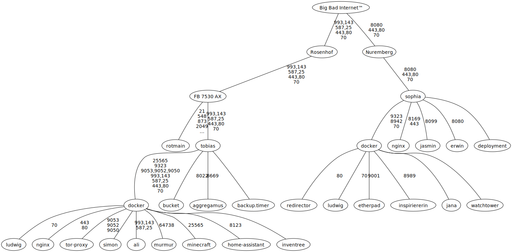

# chrissx.de config files

These are most of the config files and scripts used on chrissx Media operated infrastructure.

## Infrastructure

### Hardware

| Hostname    | Hardware                                    | Location  | OS                   | Status                | Cost    |
| ----------- | ------------------------------------------- | --------- | -------------------- | --------------------- | ------- |
| sophia      | Hetzner CX11                                | Nuremberg | Ubuntu Server 22.04  | running               | 3.5€/mo |
| tobias      | Lenovo ThinkCentre M710s                    | Rosenhof  | Ubuntu Server 22.04  | running               | 140€    |
| rotmain     | Synology DS1821+, 8x Seagate IronWolf 8TB   | Rosenhof  | DSM 7                | running               | 3500€   |
| veldenstein | Custom (Pentium G4400 based), 4x WD Red 4TB | Rosenhof  | Ubuntu Desktop 22.04 | emergency cold backup | 1000€   |

### DNS

#### Internal

| Type  | Name                   | Content               |
| ----- | ---------------------- | --------------------- |
| A     | `op.chrissx.de`        | `192.168.178.68`      |
| A     | `rotmain.chrissx.de`   | `192.168.178.29`      |
| A     | `dergerät.chrissx.de`  | `192.168.178.34`      |
| CNAME | `dergeraet.chrissx.de` | `dergerät.chrissx.de` |
| CNAME | `dergerat.chrissx.de`  | `dergerät.chrissx.de` |

#### External

| Type  | Name                           | Content                    |
| ----- | ------------------------------ | -------------------------- |
| A     | `rosenhof.chrissx.de`          | (DynDNS)                   |
| AAAA  | `rosenhof.chrissx.de`          | (DynDNS)                   |
| A     | `sophia.chrissx.de`            | `78.47.163.103`            |
| AAAA  | `sophia.chrissx.de`            | `2a01:4f8:c0c:69c8::`      |
| CAA   | `chrissx.de`                   | `0 issue letsencrypt.org`  |
| MX    | `chrissx.de`                   | `mail.chrissx.de`          |
| CNAME | `ampless.chrissx.de`           | `sophia.chrissx.de`        |
| CNAME | `amplus.chrissx.de`            | `sophia.chrissx.de`        |
| CNAME | `autoconfig.chrissx.de`        | `rosenhof.chrissx.de`      |
| CNAME | `bucket.chrissx.de`            | `rosenhof.chrissx.de`      |
| CNAME | `cpm.chrissx.de`               | `sophia.chrissx.de`        |
| CNAME | `fonts.chrissx.de`             | `sophia.chrissx.de`        |
| CNAME | `ftp.chrissx.de`               | `rosenhof.chrissx.de`      |
| CNAME | `get.cpm.chrissx.de`           | `sophia.chrissx.de`        |
| CNAME | `git.chrissx.de`               | `rosenhof.chrissx.de`      |
| CNAME | `ha.chrissx.de`                | `rosenhof.chrissx.de`      |
| CNAME | `inv.chrissx.de`               | `rosenhof.chrissx.de`      |
| CNAME | `lyrics.chrissx.de`            | `sophia.chrissx.de`        |
| CNAME | `mail.chrissx.de`              | `rosenhof.chrissx.de`      |
| CNAME | `mc.chrissx.de`                | `rosenhof.chrissx.de`      |
| CNAME | `media.chrissx.de`             | `sophia.chrissx.de`        |
| CNAME | `meme.chrissx.de`              | `sophia.chrissx.de`        |
| CNAME | `mumble.chrissx.de`            | `rosenhof.chrissx.de`      |
| CNAME | `new.chrissx.de`               | `sophia.chrissx.de`        |
| CNAME | `old.chrissx.de`               | `sophia.chrissx.de`        |
| CNAME | `pad.chrissx.de`               | `sophia.chrissx.de`        |
| CNAME | `penis.chrissx.de`             | `sophia.chrissx.de`        |
| CNAME | `pixel.chrissx.de`             | `sophia.chrissx.de`        |
| CNAME | `porn.chrissx.de`              | `sophia.chrissx.de`        |
| CNAME | `qa.chrissx.de`                | `sophia.chrissx.de`        |
| CNAME | `screwed.chrissx.de`           | `sophia.chrissx.de`        |
| CNAME | `tor.chrissx.de`               | `op.chrissx.de`            |
| CNAME | `wiki.chrissx.de`              | `sophia.chrissx.de`        |
| CNAME | `alditalk-kundenbetrug.de`     | `sophia.chrissx.de`        |
| CNAME | `chrissx.de`                   | `sophia.chrissx.de`        |
| CNAME | `chrisxeric.de`                | `sophia.chrissx.de`        |
| CNAME | `elonisnwichser.de`            | `sophia.chrissx.de`        |
| CNAME | `fuxgames.com`                 | `sophia.chrissx.de`        |
| CNAME | `gock.dev`                     | `sophia.chrissx.de`        |
| CNAME | `kinkcheck.top`                | `sophia.chrissx.de`        |
| CNAME | `lowlevelmusic.com`            | `sophia.chrissx.de`        |
| CNAME | `zerm.eu`                      | `sophia.chrissx.de`        |
| CNAME | `zerm.link`                    | `sophia.chrissx.de`        |
| CNAME | `www.alditalk-kundenbetrug.de` | `alditalk-kundenbetrug.de` |
| CNAME | …                              | …                          |
| CNAME | `www.zerm.link`                | `zerm.link`                |

<!-- vim: set wrap! : -->
